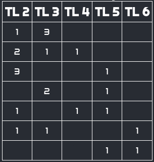

# <a href='https://waaaaagh.com/squad-permutator'>squad-permutator</a>
 For use with AMG's Marvel: Crisis Protocol. This app will - given an input of 10 characters, a leader, and a mission level - dynamically output a table of all possible squad combinations

## The Game

### What is Marvel: Crisis Protocol
Marvel: Crisis Protocol is a miniature-based tabletop skirmish game, published by Atomic Mass Games and set in the Marvel Comics universe. Players collect, assemble, and paint their favorite heroes and villains, and pit them against their opponents.

### Gameplay Basics
- Each player brings a list of ten characters
- That list must include at least one leader
- Every character is assigned a 'Threat Value

## What am I looking at?
In a game of Crisis Protocol, each player will bring ten characters, one of which is their leader. Each character has a 'threat level' ranging from 2-6 (there's actually a 7 and an 8 out there, too. Someday this calculator will account for them, but right now not a high priority). Players will select missions, which have their own threat level ranging from 14-20. Players will then select characters from their list of ten that add up to the mission's threat level.

What this calculator does is take as input a) the player's ten characters by threat level, b) the player's leader's threat level, and c) the mission threat level. It then dynamically generates a table showing _every possible permutation_ of characters the player could take for that mission given their selected leader.

For example: my list consists of 3xTL2s, 4xTL3s, 1xTL4, 1xTL5, and 1xTL6. My leader is TL3, and the mission is TL14. When I input this into the calculator, I get this as a result:

As you can see, I can take a two and three threes; two twos, a three, and a four; a five and a six; etc. - note that this is _in addition_ to your leader, who is not included in the table. This is because a) the total threat of these characters is equal to the threat of the mission minus the leader's threat, and b) the total characters of each threat value does not exceed the total number available.